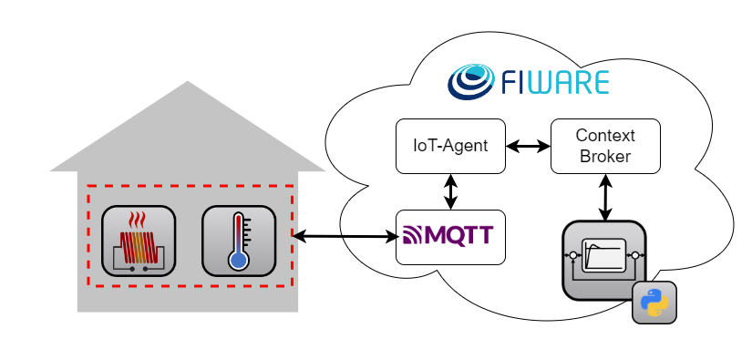

# Summary

FIWARE, an open-source initiative providing open-source software platform components and a set of standardized APIs (Application Programming Interfaces), has been instrumental in driving digitalization across various domains and research fields [@araujo_performance_2019].
The use of FIWARE enables faster, easier, and cheaper developments of a wide range of IoT-enabled solutions [@fiware:2023]. 
Over the years, the FIWARE Next-Generation-Service-Interface (NGSI-v2) API specification has been well-developed. 
There is also a variety of reusable software components, so-called Generic Enablers ([GEs](https://github.com/FIWARE-GEs)), complying with NGSI-v2 [@canterafonsecaFIWARENGSIV2Specification], including [Orion Context Broker](https://github.com/telefonicaid/fiware-orion), [IoT Agent](https://github.com/telefonicaid/iotagent-node-lib), and [QuantumLeap](https://github.com/orchestracities/ngsi-timeseries-api?tab=readme-ov-file). 
These components play a pivotal role in core context information management, IoT device connectivity, and time-series database interaction [@fiware:2023].

In this context, we developed FiLiP, a Python Software Development Kit (SDK) designed to accelerate the development of services that interact with the aforementioned FIWARE GEs. 
FiLiP emerges as a powerful tool, particularly in the domain of energy management systems, where it simplifies development, enhances efficiency, and empowers developers to create reliable and reusable IoT applications, aligning with the digital transformation facilitated by FIWARE.

# Statement of need

The NGSI-v2 specification defines a standardized RESTful API to represent, exchange and manage context information throughout its entire lifecycle [@canterafonsecaFIWARENGSIV2Specification].
Researchers or application developers can refer to the specifications and build reliable and interoperable data systems.
However, NGSI-v2 is a general cross-domain specification and does not provide any domain-specific information models. 
Although it defines the general data structure of entities, the definition of domain-specific attributes and metadata information remains in the responsibility of the users.
Hence, adopting the specification for domain-specific engineering applications requires extensive training in both data modeling and programming of IoT applications.
Additionally, the specification has continuously evolved over time, necessitating significant efforts to define domain-specific data models and to ensure that applications and models comply with the latest specification.

Existing FIWARE APIs client libraries can already provide some basic support but often fall short in several key areas.
A comparison as shown in Table \ref{Comparison} reveals the shortage of various existing libraries, including limited support for multiple FIWARE APIs, lack of advanced validation and data models integration, and unsatisfactory usability and reliability.

| Library                                            | API Support                                               | Validation         | Datamodel            | Learning Support                         | Test Cases           |
|----------------------------------------------------|-----------------------------------------------------------|--------------------|----------------------|------------------------------------------|----------------------|
| QuantumLeapClient [@QuantumLeapClient]             | TS                                                        | -                  | -                    | Readme file                              | 18                   |
| fiware-ngsi-api [@fiware-ngsi-api]                 | D, E                                                      | Basic    | Proprietary     | -                                        | -                    |
| fiot-client-ngsi-python [@fiot-client-ngsi-python] | D<sup>*</sup>, E, S                                       | -                  | -                    | Readme file  | 31                   |
| orion-python-client [@orion-python-client]         | E, S<sup>*</sup>                                          | -                  | -                    | Readme file                              | 1                    |
| FiLiP                                              | Device (D), Entity (E), Subscription (S), TimeSeries (TS) | Enhanced | Customizable         | Documentation, 12 examples, and 8 tutorials| 82 (84% coverage)    |
: Comparison of FiLiP with existing FIWARE APIs client libraries. "-" indicates that the feature is not supported or not available. "*" indicates that the feature is available but incomplete.\label{Comparison}

Although FIWARE provides OpenAPI specifications [@openapi] [@canterafonsecaFIWARENGSIV2Specification], which can be used to automatically generate API clients for various programming languages, there are still issues that make those auto-generated API clients less reliable:

- The quality of auto-generated code strongly depends on the provided input data, i.e. OpenAPI specification.
- Integrating additional features is generally not viable because manipulating the generated code can result in larger maintenance efforts.
- The generated clients do not enable advanced data validation and reasonable error handling.

As a result, the lack of a comprehensive and reliable tool kit continues to hinder the adoption of FIWARE-based platforms in research fields and industrial applications.
To overcome the aforementioned issues and shortcomings of the existing solutions, we present FiLiP (Fiware Library for Python).

# Implementation

As the name suggests, the library is written in Python and provides a set of client classes for typical recurring GEs for IoT systems.
Currently, FiLiP supports Orion Context Broker for central data management, IoT Agent for modular IoT-Interfaces, and QuantumLeap for time-series management.
The interactions with the API endpoints are implemented as methods of these corresponding *"Clients"*.
For example, the `ContextBrokerClient` implements typical CRUD (create, read, update, and delete) operations for the NGSI-v2 Context Broker.
By encapsulating API interactions in these specialized clients, FiLiP eliminates the necessity for users to create unreliable data models and consult API documentation for endpoint details.
Instead, users can directly invoke clients' methods of FiLiP, thereby automating the composition and dispatch of the requisite CRUD operations. 
This feature greatly reduces the difficulty of getting started with the FIWARE-based platform and also accelerates the development of applications. 

To enhance the efficiency of service development, FiLiP offers a range of advanced functionalities.
One of them is the robust and enhanced implementation of data parsing and validation via the Pydantic library [@pydantic]. 
The information models defined by NGSI-v2 API standards are implemented as Pydantic data models in FiLiP.
In addition to basic validation tasks such as verifying the `id` and `type` required to identify an entity, FiLiP offers numerous enhanced validation functionalities.
For instance, we have developed a custom validator that checks the unit specified in metadata based on UN/CEFACT standards [@uncefact].
When these validations are successful, the validator enriches the metadata with additional information such as symbol, conversion factor, and description.
This enhanced validation functionality ensures data quality and integrity in interactions with FIWARE GEs, while also reducing the effort required from developers.

Another enhanced functionality of FiLiP is the data model integration. In practice, individual domains often necessitate domain-specific, and even application-specific data models to meet distinct requirements.
The FiLiP *"Models"*, e.g., `ContextEntity` and `ContextEntityKeyValues`, facilitate this process by offering parent classes that ensure adherence to FIWARE API standards.
Consequently, specific attributes can be defined to construct data models tailored to particular use cases, while the compliance with FIWARE is also validated and ensured by the provided FiLiP *"Models"*.

Since *"Clients"* and *"Models"* constitute the core features of FiLiP, the reliability of these components is pivotal to the overall usability and effectiveness of the library.
In the realm of open-source software development, maintaining code quality and dependability is paramount. 
FiLiP accomplishes this by implementing 82 test cases based on the Python unit testing framework [@unitest], currently covering over 80 % of the code base.

In general, the abstraction of API endpoints, implementation of data parsing and enhanced validation, and the comprehensive testing workflow enable FiLiP to simplify the development process of applications by reducing the need for API specification reading, manual data checking, and functional validation within the application code.
Thus, FiLiP effectively avoids the use for unreliable boilerplate code, thereby reducing overall development and maintenance costs.

# Use Case

FiLiP has already been used to deploy various cloud-based building energy management systems [@storek_application_2019; @kumpel_cloud_2019; @blechmann_open_2023].
Among those, one simplified use case is to regulate the indoor air temperature of an office via IoT-enabled devices and a simple controller. 
\autoref{fig:usecase} shows an office in a building equipped with two smart devices: a smart temperature sensor and a smart electrical heater, which can send measurements or receive commands, respectively, via Message Queuing Telemetry Transport (MQTT) protocol. 
FiLiP provides reliable functionalities to deploy and commission a control service efficiently.

{ width=70% }

To establish the communication workflow, entities and IoT devices must be registered in the corresponding FIWARE components, i.e., Context Broker and IoT Agent. 
In the following example, by using FiLiP, an office room can be registered using `post_entity()` method of the `ContextBrokerClient`. 
An entity object of the office is created using the `ContextEntity` class, which specifies those mandatory properties of the office and can validate their compliance. 
Similarly, a temperature sensor and a heater can also be registered as IoT devices by calling `post_device()` method of the `IoTAgentClient` of FiLiP. 
The classes `Device` and `DeviceAttribute` help to create the device models more efficiently and correctly. 
Especially for the various setting parameters of `Device`, e.g. `transport` and `protocol`, the validation can avoid ambiguity and significantly simplifies the development.

```python
# create entities
office = ContextEntity(id="Office:001", type="Office")
context_broker_client.post_entity(entity=office)

# provision IoT sensor
t_zone = DeviceAttribute(name='temperature', type="Number")
temperature_sensor = Device(
    device_id='device:001',
    entity_name='TemperatureSensor:001',
    entity_type='TemperatureSensor',
    protocol='IoTA-JSON',
    transport='MQTT',
    apikey=APIKEY,
    attributes=[t_zone])
iot_client.post_device(device=temperature_sensor)

# provision IoT actuator
heating_power = NamedCommand(name="heating_power")
heater = Device(
    device_id='device:002',
    entity_name='Heater:001',
    entity_type='Heater',
    protocol='IoTA-JSON',
    transport='MQTT',
    apikey=APIKEY,
    commands=[heating_power])
iot_client.post_device(device=heater)
```

Besides, FiLiP can be used to add semantic information to the data points. 
In the example below, the temperature sensor is associated with the office through a relationship labeled `hasSensor`.
Another relationship `locatedIn` can further link this office with a building, provided that the entity of that building already exists.

```python
# add semantic information
hasSensor = NamedContextAttribute(
    name="hasSensor",
    type="Relationship",
    value=temperature_sensor.entity_name)

locatedIn = NamedContextAttribute(
    name="locatedIn",
    type="Relationship",
    value=building.id)

office.add_attributes(attrs=[hasSensor, locatedIn])
```

To this end, data can be exchanged between the FIWARE-based platform and the smart devices.
A controller can then be deployed as a cloud service to regulate the indoor temperature of the office. 
With the help of FiLiP, a communication interface between the controller and the FIWARE GEs can be efficiently established as well.

```python
# retrieve data from the temperature sensor
temperature = context_broker_client.get_attribute_value(
    entity_id=temperature_sensor.entity_name,
    entity_type=temperature_sensor.type,
    attr_name=t_zone.name)

# calculate new set point with controller logic
heating_power.value = controller_logic(temperature=temperature)


# send command to the heater entity
context_broker_client.post_command(
    entity_id=heater.id,
    entity_type=heater.type,
    command=heating_power)
```
The presented use case exemplifies how FiLiP plays a pivotal role in the implementation of IoT-enabled applications using FIWARE GEs.
To shorten the learning curve for developers and researchers, we provide examples for individual functions as entry points and comprehensive workshop materials for developing a complete FIWARE-based application leveraging FiLiP [@storekFIWAREEnergySystem2023].
Hence, developers can efficiently get informed and focus on building innovative IoT solutions.

# Conclusion

The primary strengths of using FiLiP encompass the following key aspects:

- **Simplified Development**: FiLiP simplifies interaction with FIWARE GEs by providing classes like `ContextEntity` and `Device`, ensuring validated data exchange and informed decisions without advanced expertise.

 
- **Maintainable Applications**: FiLiP encapsulates API interactions within class methods, separating application logic from the dynamic evolving NGSI-v2 APIs. This approach enhances application reusability and maintainability.


- **Reliable Functionalities**: FiLiP's comprehensive testing, with over 80% coverage, ensures code quality and allows developers to focus on developing applications.

In conclusion, FiLiP is a robust and reliable tool.
With FiLiP, developers can efficiently create innovative IoT applications, and researchers can explore smart solutions in various domains, including energy management and beyond.

# Acknowledgements
We gratefully acknowledge the financial support provided by the Federal Ministry for Economic Affairs and Climate Action (BMWK), promotional references 03ET1495A, 03ET1551A, 0350018A, 03ET1561B, 03EN1030B.

# References
