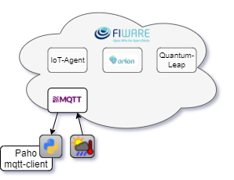
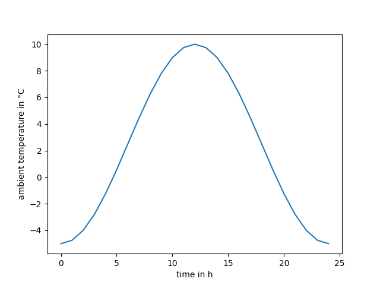

# Tutorial 1: MQTT Basics

Create a virtual IoT device that simulates the ambient temperature of a
weather station and publishes it to an MQTT broker. The tutorial provides a
complete MQTT publisher/subscriber setup using the `paho-mqtt` package: the
client subscribes to the same topic it publishes to, so a subscriber callback
receives the simulated messages and the received data is visualized
afterwards. This gives a simple introduction to communication via MQTT and to
how a simulation model can be connected to a message broker.

  

## Learning Objectives

- Understand the basic MQTT concepts: broker, topics, publish and subscribe
- Configure a `paho-mqtt` client with username/password credentials and TLS
- Handle incoming messages with a subscriber callback and store them in a
  history list
- Publish simulated sensor data as JSON to an MQTT topic
- Visualize the received time-series data with matplotlib

## Expected Outcome

The script `t1_mqtt_basics.py` is fully implemented and is organized into the
following parts that work together:

1. **Parameters**: the MQTT topic
   (`/json/ebc_dev_apikey1/weather_station`), the temperature bounds of the
   simulation (−5 °C to 10 °C) and the simulation window (24 h in hourly
   steps).
2. **Subscriber callback**: `on_message` is triggered automatically whenever
   the client receives a message on a subscribed topic. It decodes the raw
   payload, parses the JSON and appends the data to the shared `history`
   list (passed into the client as `user_data`).
3. **Client setup**: `setup_mqtt_client` creates the MQTT client, sets the
   credentials, enables TLS, registers the callback, connects to the broker
   and subscribes to the topic.
4. **Publisher loop**: `run_simulation_and_publish` advances the
   `SimulationModel` step by step, publishes the current ambient temperature
   and simulation time as JSON and pauses briefly for educational effect.
5. **Visualization**: `plot_results` extracts the received data from the
   history and plots the ambient temperature over the simulated time.

Running `python t1_mqtt_basics.py` prints the progress of the setup, the
subscribed messages and the publishing loop, and finally shows a plot of the
simulated ambient temperature — a sinusoidal 24 h cycle between −5 °C and
10 °C — as shown below.

  

## What to try next

- Change `TEMPERATURE_MIN`, `TEMPERATURE_MAX`, `T_SIM_END` or `COM_STEP` to
  simulate a different weather profile or a shorter/longer period
- Publish additional attributes (e.g. humidity) next to the temperature
- Publish to a second topic and create an independent subscriber to receive
  it
- Replace the fixed `time.sleep` with real-time pacing so the simulation
  matches the actual time
