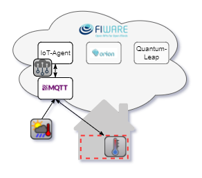
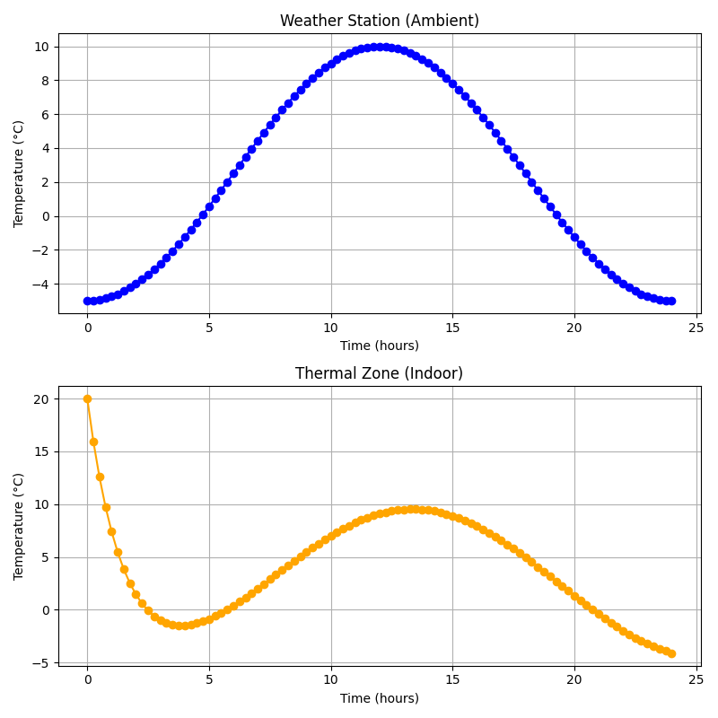

# Tutorial 2: Provisioning Sensors

Create two virtual IoT devices: a temperature sensor for the air temperature
of a thermal zone and a virtual weather station. Both devices are registered
in the FIWARE platform and publish their values via MQTT to an IoT Agent,
which forwards them to the Context Broker and stores the time series in
QuantumLeap. In contrast to Tutorial 1, the data now flows through a complete
FIWARE data pipeline from the simulated device all the way into the
historical database.

  

## Learning Objectives

- Understand the role of the main FIWARE components: IoT Agent, Context
  Broker (Orion) and QuantumLeap
- Provision service groups and devices with filip's `IoTAClient`
- Define device attributes and create subscriptions that forward data to the
  time-series database
- Publish data to the IoT Agent's MQTT ingress topics
  (`/json/{apikey}/{device_id}/attrs`)
- Retrieve historical data from QuantumLeap and visualize it

## Expected Outcome

The script `t2_provision_sensor.py` is fully implemented and is organized
into the following parts that work together:

1. **Platform cleanup**: the previous state of the IoT Agent, Context Broker
   and QuantumLeap is cleared so the tutorial can be run repeatedly.
2. **Provisioning**: `provision_temperature_sensor` registers a service
   group for each device type (WeatherStation, TemperatureSensor), creates
   the device with its attributes (`temperature`, `sim_time`) and posts a
   subscription so the Context Broker forwards every update to QuantumLeap.
3. **Publisher**: `run_simulation_and_publish` advances the
   `SimulationModel` and publishes the ambient temperature of the weather
   station and the zone temperature of the thermal zone to the IoT Agent via
   MQTT.
4. **Data retrieval**: `fetch_historical_data` queries QuantumLeap for the
   stored time series of each entity.
5. **Visualization**: `plot_results` plots the ambient and the zone
   temperature over the simulated 24 h in 15 min steps.

Running `python t2_provision_sensor.py` prints the progress of the cleanup,
provisioning, publishing and data retrieval, and finally shows a two-panel
plot with the ambient temperature (blue) and the thermal zone temperature
(orange) as shown below.

  

## What to try next

- Add a third device (e.g. a humidity sensor) and repeat the provisioning
  for it
- Query the current entity state directly from the Context Broker instead of
  only using the historical data
- Change `COM_STEP` to adjust the temporal resolution of the recorded data
- Experiment with different service groups, entity types and device IDs to
  see how they appear in the platform
