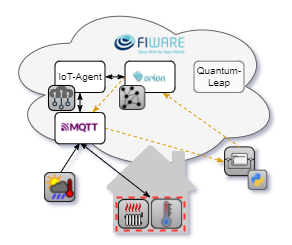
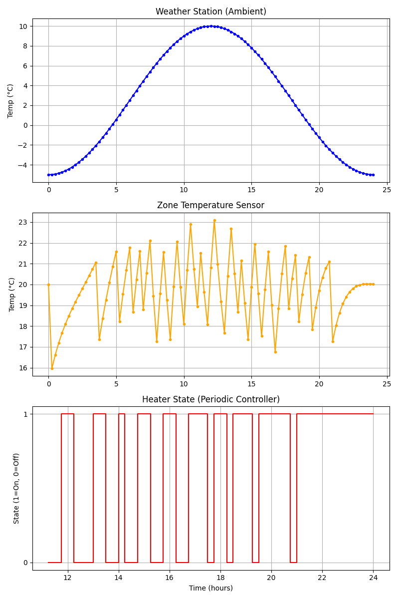

# Tutorial 3: Deploying a Controller

Extend the virtual thermal zone from Tutorial 2 with a heater actuator and a
hysteresis controller. The heater is registered as a context entity in the
platform; a controller running in a background thread polls the zone
temperature and turns the heater on and off, forwarding the command to the
MQTT broker, where a virtual actuator receives it and applies it to the
simulation model. The provisioning of the two sensors from Tutorial 2 is
reused via import from `t2_provision_sensor.py`.

  

## Learning Objectives

- Register an actuator (the heater) as a context entity and link one of its
  attributes to an MQTT command topic via a subscription
- Set up an MQTT actuator that receives commands and applies them to the
  simulation model
- Implement a periodic hysteresis controller that reads the current zone
  temperature and decides the heater state
- Understand the data flow: Context Broker → MQTT → actuator → simulation
  model
- Visualize the ambient temperature, the zone temperature and the heater
  state

## Expected Outcome

The script `t3_deploy_controller.py` is fully implemented and is organized
into the following parts that work together:

1. **Platform cleanup**: the previous state of the platform is cleared and
   the two sensors (WeatherStation, TemperatureSensor) are provisioned again
   using the logic from Tutorial 2.
2. **Provisioning the heater**: `provision_heater` creates the Heater
   context entity with the attributes `heater_on` and `sim_time`, posts a
   subscription (`mqttCustom`) that forwards every change of `heater_on` to
   the MQTT command topic, and a second subscription that stores the history
   in QuantumLeap.
3. **Actuator**: `setup_heater_actuator` connects a virtual heater to the
   command topic. Its callback decodes the received payload and updates
   `sim_model.heater_on`, which is what actually affects the simulated zone
   temperature.
4. **Controller**: `run_periodic_controller` runs in a background thread. It
   polls the current zone temperature from the Context Broker and applies a
   hysteresis: the heater is turned on below 19 °C and off above 21 °C. The
   command is sent by updating the `heater_on` attribute with
   `forcedUpdate=True`.
5. **Simulation**: `run_local_simulation` publishes the sensor data of both
   devices via MQTT, updates the heater's `sim_time` directly in the Context
   Broker and advances the simulation, now taking the heater state into
   account.
6. **Visualization**: `plot_results` plots the ambient temperature, the zone
   temperature and the heater state over the simulated 24 h.

Running `python t3_deploy_controller.py` prints the progress of the
provisioning, the controller polling loop and the actuator commands, and
finally shows a three-panel plot with the ambient temperature, the zone
temperature (kept within the hysteresis band) and the heater on/off state as
shown below.

  

## What to try next

- Change the hysteresis set points (19 °C / 21 °C) or widen/narrow the dead
  band in `run_periodic_controller`
- Replace the on/off hysteresis with a proportional or PI/PID controller
- Run the controller as a separate process or container that only
  communicates with the platform
- Let the heater affect the zone temperature differently, e.g. by adapting
  the heat flow `q_h` of the simulation model
